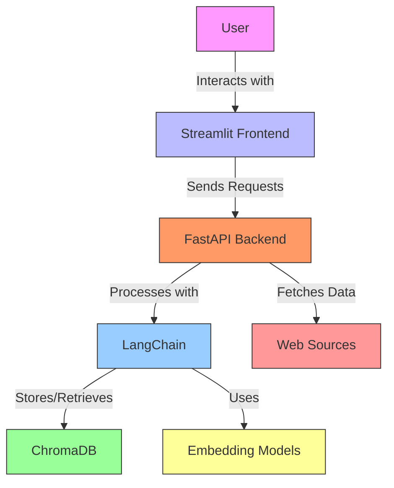

# AI Web Intelligence & Research Assistant

[](https://www.python.org/downloads/)
[](https://fastapi.tiangolo.com/)
[](https://streamlit.io/)
[](https://python.langchain.com/)

An intelligent web research assistant that leverages AI to help users gather, process, and understand information from multiple web sources efficiently.

## 🎯 Motivation
The goal of this project was to understand how modern AI systems:
- Combine LLMs with external knowledge
- Scale beyond prompt-only approaches
- Reduce hallucinations using vector search

## 🌟 Features

- **Web Content Ingestion**: Automatically extract and process content from multiple URLs
- **Semantic Search**: Find relevant information using vector embeddings
- **Question Answering**: Get precise answers to your research questions
- **Document Processing**: Automatically chunk and index documents for efficient retrieval
- **Modern Web Interface**: Intuitive Streamlit-based UI for easy interaction

## 🏗️ Architecture



The system follows a modern microservices architecture with the following components:

1. **Frontend**: Streamlit-based web interface
2. **Backend API**: FastAPI server handling business logic
3. **Vector Database**: ChromaDB for efficient similarity search
4. **AI Processing**: LangChain for document processing and question answering
5. **Web Scraping**: BeautifulSoup4 for content extraction

## 🛠️ Tech Stack

### Backend
- **Framework**: FastAPI
- **AI/ML**: LangChain, Sentence Transformers
- **Vector Database**: ChromaDB
- **Web Scraping**: BeautifulSoup4, Requests
- **NLP**: NLTK

### Frontend
- **Framework**: Streamlit
- **UI Components**: Custom Streamlit components

## 🚀 Getting Started

### Prerequisites
- Python 3.8+
- pip (Python package manager)

### Installation

1. Clone the repository:
```bash
git clone https://github.com/yourusername/ai-web-intelligence-assistant.git
cd ai-web-intelligence-assistant
```

2. Set up the backend:
```bash
cd backend
python -m venv .venv
.venv\Scripts\activate  # On Windows
pip install -r requirements.txt
```

3. Set up the frontend:
```bash
cd ../frontend
pip install -r requirements.txt
```

### Running the Application

1. Start the backend server:
```bash
cd backend
uvicorn app.main:app --reload
```

2. In a new terminal, start the frontend:
```bash
cd frontend
streamlit run streamlit_app.py
```

3. Open your browser and navigate to `http://localhost:8501`

## 📚 Usage

1. **Ingest Knowledge**:
   - Enter website URLs in the text area
   - Click "Ingest URLs" to process the content

2. **Ask Questions**:
   - Type your research question
   - Click "Ask" to get AI-powered answers

## 🧩 Retrieval-Augmented Generation (RAG)

This project uses a Retrieval-Augmented Generation (RAG) pipeline:

- Documents are embedded and stored in a vector database
- Relevant context is retrieved at query time
- The LLM generates answers strictly based on retrieved context

This prevents hallucinations and ensures source-grounded answers.

## ⚠️ Limitations
- Answers are limited to ingested sources only
- Large models may require higher system memory
- No authentication or multi-user support (yet)

## 🤝 Contributing

Contributions are welcome! Please feel free to submit a Pull Request.

## 📄 License

This project is licensed under the MIT License - see the [LICENSE](LICENSE) file for details.

## 🙏 Acknowledgments

- LangChain for the amazing AI orchestration framework
- ChromaDB for the lightweight vector database
- Streamlit for the intuitive web interface
